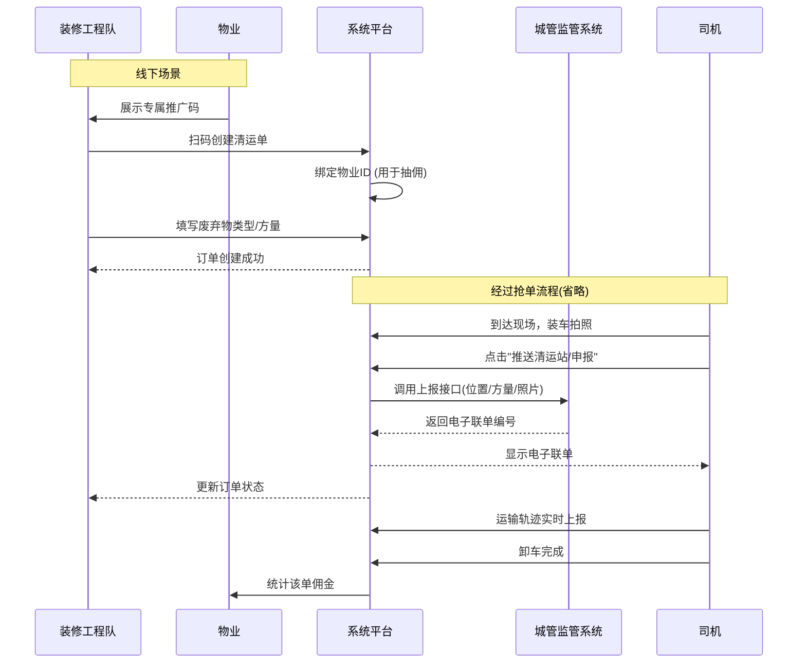
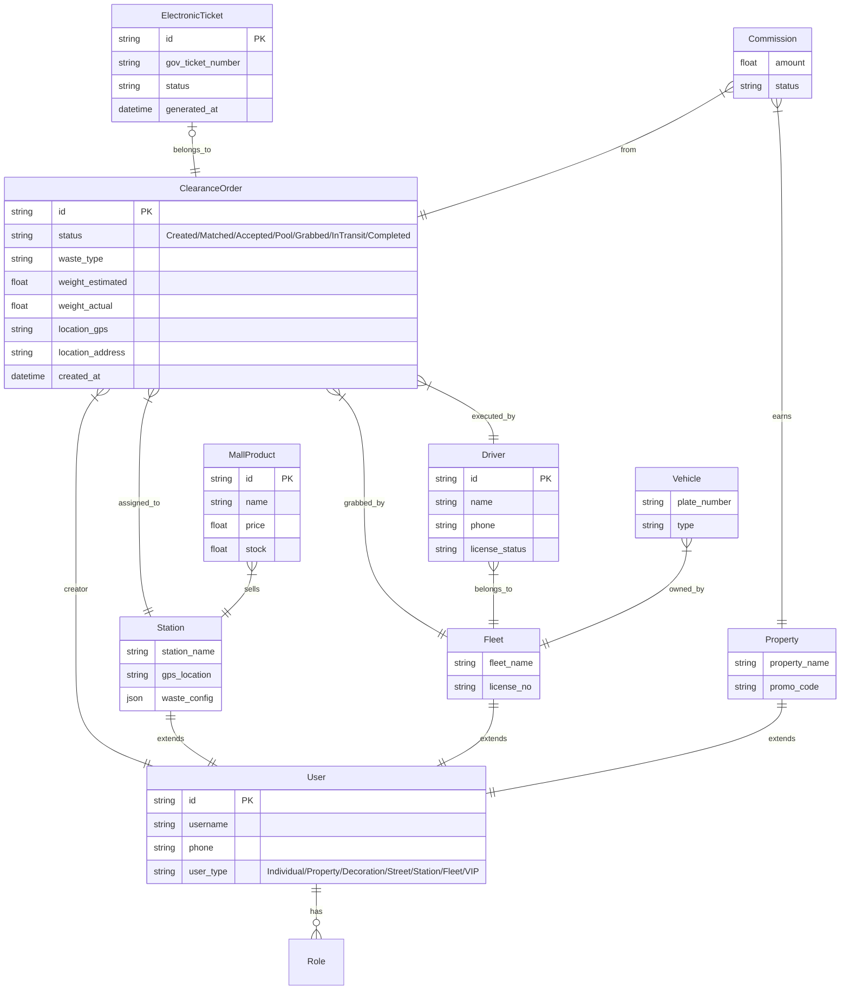
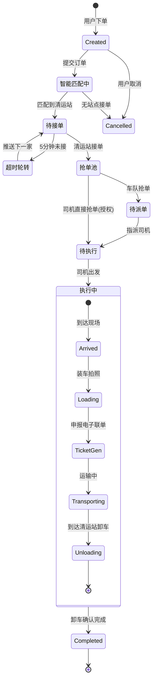

# 智慧垃圾清运系统需求规格说明书 v4.1

## 1. 引言

### 1.1 项目背景
随着城市化进程的加快，垃圾清运面临着效率低、监管难、协同差等挑战。本系统旨在构建一套智慧化的垃圾清运管理平台，连接个体户、物业、装修工程队、街道办、清运站及VIP客户，实现清运全流程的数字化、智能化和规范化。

### 1.2 文档目的
本文档基于《智慧垃圾清运系统规划方案v4.0》的第一版需求，结合最新的业务理解，梳理并明确了系统的核心功能与用户场景，作为系统开发和测试的依据。

## 2. 用户角色定义

系统共包含七类核心用户，各类用户职责如下：

1.  **个体户**：产生生活垃圾或少量商业垃圾的小微商户/个人，需求侧重于便捷投放和即时清运。
2.  **物业**：负责小区或园区环境管理的单位，需求侧重于辖区垃圾状态监控和协同调度。
3.  **装修工程队**：产生建筑装修垃圾的施工方，需求侧重于大方量垃圾的合规预约与清运。
4.  **街道办**：政府监管部门，需求侧重于全域数据监控、违规预警和考核评价。
5.  **清运站**：垃圾中转与处理站点，需求侧重于车辆调度、计量称重和转运管理。
6.  **车队**：拥有运输车辆和司机的运营主体，需求侧重于司机管理、订单分发与运力统计。
7.  **VIP客户**：产生量大且稳定的大型企业或机构，需求侧重于定制化服务和周期结算。

## 3. 功能需求详情

### 3.1 个体户端
面向小微商户和个人用户的移动端入口（小程序/App）。

*   **创建清运单（智能下单）**：
    *   **GPS定位**：点击创建后，自动获取手机GPS定位，并在地图上显示，用户可微调选择准确位置。
    *   **地址填写**：基于定位自动解析地址，用户补充门牌号等具体信息。
    *   **AI拍照识别**：用户拍摄垃圾照片上传，系统调用AI视觉算法自动识别垃圾类型（如厨余、可回收、大件垃圾等）。
    *   **智能描述与估重**：系统根据识别结果，自动生成垃圾描述文本（如“废旧沙发一套”、“装修废料约5袋”）并自动预估重量/方量填入对应字段，用户可进行修改确认。
    *   **提交需求**：用户确认信息无误后提交订单。
*   **扫码投递**：扫描智能垃圾桶/房二维码，开盖投递，系统自动称重并积分。
*   **费用支付**：支持微信/支付宝在线支付清运费用，查看消费明细。
*   **积分商城**：查看环保积分，兑换礼品或抵扣清运费。
*   **投诉建议**：对清运服务不及时或态度问题进行投诉。

### 3.2 物业端
面向小区/园区物业管理人员的管理工具。

*   **多小区管理**：查看并管理名下所有小区的清运单和历史清运记录。
*   **推广与获客**：
    *   **专属推广码**：生成带有物业标识的专属二维码，可分享给装修公司或业主。
    *   **佣金管理**：通过专属码创建的清运单，物业可获得平台抽佣，系统提供佣金统计与提现功能。
*   **状态监控**：实时查看辖区内垃圾桶/房的满溢状态，接收满溢报警。
*   **工单管理**：接收居民/商户的清运需求，指派或转单给清运公司。
*   **巡查上报**：物业人员在巡查中发现乱堆乱放问题，拍照上报并跟踪处理。
*   **数据统计**：查看本小区的垃圾分类投放率、清运及时率等报表。
*   **公告通知**：向辖区用户发布垃圾清运时间调整、分类指南等通知。

### 3.3 装修工程队端
面向建筑装修垃圾产生的施工方。

*   **创建工程清运单**：
    *   **项目地址管理**：针对装修项目创建独立的清运地址。
    *   **扫码绑定物业**：支持扫描物业提供的专属二维码创建订单。扫码后，该清运单自动绑定对应物业信息，作为后续统计汇总及物业抽佣的依据。
    *   **下单模式**：
        *   **指定指派**：可直接指定合作的车队和清运站进行清运。
        *   **公开发布**：类似个体户模式，将需求发布到平台，由系统匹配清运站及车队抢单。
*   **大件/装修预约**：填写施工地点、废弃物类型（渣土、砖瓦等）、预估方量，预约专用车辆。
*   **电子联单**：生成符合监管要求的电子转移联单，记录产生、运输、处置全过程，确保合规。
*   **车辆追踪**：实时查看预约车辆的位置和预计到达时间。
*   **费用结算**：按车次或方量计算费用，支持在线结算或生成对账单。

### 3.4 街道办端（监管驾驶舱）
面向政府监管部门的大数据可视化大屏及移动端管理入口（小程序）。

*   **街道清运管理**：
    *   **辖区数据查看**：查看街道范围内所有的垃圾清运单及历史清运记录。
    *   **范围界定**：创建清运单或查看数据时，地址选择严格遵循行政区划（省/市/县区/街道）固化选择模式，再填写详细地址，确保数据归属准确。
*   **创建街道清运单**：
    *   **需求发布**：支持街道办自行发起清运需求（如公共区域清理）。
    *   **下单模式**：
        *   **指定指派**：指定长期合作的车队或清运站。
        *   **公开发布**：类似个体户模式，发布到平台由社会力量抢单。
*   **数据驾驶舱**：全屏展示辖区垃圾清运总量、分类成效、车辆分布、站点状态等核心指标。
*   **全域地图**：GIS地图展示所有车辆轨迹、垃圾站点位置及实时状态（正常/满溢/故障）。
*   **违规预警**：自动识别并报警车辆违规路线、偷倒漏倒、长时间滞留等异常行为。
*   **考核评价**：对各物业公司、清运公司的服务质量、响应速度进行数据化考核排名。
*   **投诉督办**：查看并督办辖区内的未解决投诉案件。

### 3.5 清运站端（作业端）
面向中转站或处理中心的操作人员。

*   **站点配置**：
    *   **基础信息配置**：设置清运站的具体地理位置（经纬度/地图选点）。
    *   **业务规则配置**：自定义接收的垃圾分类类型（如仅收建筑垃圾、仅收厨余垃圾等）以及对应的处理费用标准。
*   **智能接单**：
    *   **自动匹配**：系统根据用户提交的垃圾分类和距离，自动将订单推送给最近的符合条件的清运站。
    *   **超时流转**：清运站需在5分钟内接单，若超时未接，系统自动将订单推送到附近其他清运站，直至有人接单。
    *   **抢单池发布**：清运站接单后，订单自动发布至“抢单池”，供所有关联车队/司机进行抢单。
*   **入库计量**：清运车辆进站自动识别（车牌识别），连接地磅自动称重记录（毛重/皮重/净重）。
*   **车辆管理**：管理清运车辆档案、维修记录、保险状态及年检提醒。
*   **视频监控**：接入站内监控视频，远程查看作业情况。
*   **再生资源商城**：
    *   **成品发布**：将处理后的再生资源（如再生骨料、金属压块、塑料颗粒等）作为商品发布到线上商城，设置价格、库存及规格描述。
    *   **出入库管理**：管理再生资源的生产入库与销售出库，实时更新库存状态。

### 3.6 VIP客户端
面向大型企业、连锁餐饮等大客户。

*   **合同管理**：查看长期服务合同详情，包括服务标准、单价、周期等。
*   **周期清运**：设定固定的清运计划（如每日定时），无需每次单独预约。
*   **月结对账**：生成月度清运详单和财务对账单，支持企业对公转账记录上传。
*   **专属客服**：一键联系专属客户经理，享受优先调度服务。
*   **定制报表**：导出符合企业ESG要求的废弃物处理及减碳报告。

### 3.7 车队端
面向拥有运输车辆和司机的运营管理方（小程序/PC端）。

*   **运力管理**：
    *   **司机管理**：添加、审核和管理车队下属司机信息。
    *   **车辆管理**：管理车辆档案、保险、年检及维修记录。
*   **订单管理**：
    *   **公海抢单**：车队管理员可在“抢单池”中批量查看并抢单，抢单后指派给车队内司机。
    *   **内部派单**：将抢到的订单或线下承接的订单，指派给指定的空闲司机。
    *   **自主下单**：车队可将线下承接的业务录入系统，创建清运单，并直接指定内部司机和合作的清运站进行履约。
*   **数据统计**：
    *   **接单统计**：按日/周/月统计车队的接单量、完单率。
    *   **司机绩效**：分析每位司机的运输单量、行驶里程、违规次数，作为绩效考核依据。
    *   **收入报表**：查看车队整体及单车的营收情况。

### 3.8 司机端
面向执行清运任务的司机（移动端App）。

*   **抢单与接单**：
    *   **公海抢单**：符合条件的司机可直接在公海池抢单（需车队授权）。
    *   **接收派单**：接收所属车队管理员指派的任务。
*   **任务执行**：
    *   **前往装车**：抢单成功后，导航至垃圾产生点。
    *   **装车上报**：
        *   **单车/多车逻辑**：系统支持单次清运和多车次往返清运。
        *   **装车拍照**：根据实际装载情况拍摄装车照片。
        *   **电子联单申报**：点击“推送清运站”，系统自动调用城管系统接口上报数据，生成并返回电子联单。
        *   **直运/往返**：若为单车任务，直接前往清运站；若为多车任务，卸车后系统指引返回产生点继续装运，记录每一车次的详细信息。
    *   **轨迹记录**：App后台实时记录车辆行驶轨迹，并在地图上展示，确保运输路线合规。
*   **卸车确认**：
    *   **进站拍照**：到达清运站后，拍摄车辆进站照片。
    *   **卸车拍照**：卸货完成后，拍摄空车/卸货完成照片。
    *   **任务完成**：确认卸车无误后，点击完成本车次任务。

## 4. 系统支撑模块

### 4.1 用户中心
*   用户注册/登录（手机号、微信授权）。
*   实名认证与企业资质审核。
*   角色权限管理（RBAC）。

### 4.2 消息中心
*   系统通知、工单状态变更通知、预警消息推送。

### 4.3 硬件接入平台
*   支持智能垃圾桶、地磅、车载GPS、监控摄像头等IoT设备的接入与数据解析。

## 5. 系统设计图表

### 5.1 系统总体用例图 (Use Case Diagram)
该图展示了系统的七大核心角色及司机角色与系统功能的交互关系。

```mermaid
usecaseDiagram
    %% 角色定义
    actor "个体户" as Individual
    actor "物业" as Property
    actor "装修工程队" as Decoration
    actor "街道办" as Street
    actor "清运站" as Station
    actor "车队" as Fleet
    actor "VIP客户" as VIP
    actor "司机" as Driver

    package "智慧垃圾清运系统" {
        %% 个体户用例
        usecase "智能下单(GPS/AI识别)" as UC_Individual_Order
        usecase "扫码投递" as UC_Scan_Drop
        usecase "积分商城兑换" as UC_Points

        %% 物业用例
        usecase "多小区管理" as UC_Prop_Multi
        usecase "推广码分享与抽佣" as UC_Prop_Commission
        usecase "满溢报警监控" as UC_Prop_Monitor
        usecase "巡查上报" as UC_Prop_Report

        %% 装修队用例
        usecase "创建工程清运单" as UC_Deco_Order
        usecase "扫码绑定物业" as UC_Deco_Bind
        usecase "电子联单申报" as UC_Deco_Ticket

        %% 街道办用例
        usecase "数据驾驶舱(全域监管)" as UC_Street_Dashboard
        usecase "违规预警处理" as UC_Street_Alert
        usecase "创建街道清运单" as UC_Street_Order

        %% 清运站用例
        usecase "站点配置(规则/价格)" as UC_Station_Config
        usecase "智能接单/抢单池发布" as UC_Station_Order
        usecase "入库计量(地磅对接)" as UC_Station_Weigh
        usecase "再生资源商城管理" as UC_Station_Mall

        %% 车队用例
        usecase "运力管理(司机/车辆)" as UC_Fleet_Manage
        usecase "公海抢单/内部派单" as UC_Fleet_Order
        usecase "自主下单" as UC_Fleet_SelfOrder
        usecase "绩效与收入统计" as UC_Fleet_Stat

        %% VIP用例
        usecase "周期清运配置" as UC_VIP_Cycle
        usecase "月结对账" as UC_VIP_Bill
        usecase "ESG报表导出" as UC_VIP_Report

        %% 司机用例
        usecase "任务执行(装车/拍照/轨迹)" as UC_Driver_Task
        usecase "电子联单上报" as UC_Driver_Ticket
        usecase "多车往返作业" as UC_Driver_MultiTrip
    }

    %% 关系连接
    Individual --> UC_Individual_Order
    Individual --> UC_Scan_Drop
    Individual --> UC_Points

    Property --> UC_Prop_Multi
    Property --> UC_Prop_Commission
    Property --> UC_Prop_Monitor
    Property --> UC_Prop_Report

    Decoration --> UC_Deco_Order
    Decoration --> UC_Deco_Bind
    Decoration --> UC_Deco_Ticket
    UC_Deco_Bind ..> UC_Prop_Commission : 触发抽佣

    Street --> UC_Street_Dashboard
    Street --> UC_Street_Alert
    Street --> UC_Street_Order

    Station --> UC_Station_Config
    Station --> UC_Station_Order
    Station --> UC_Station_Weigh
    Station --> UC_Station_Mall

    Fleet --> UC_Fleet_Manage
    Fleet --> UC_Fleet_Order
    Fleet --> UC_Fleet_SelfOrder
    Fleet --> UC_Fleet_Stat

    VIP --> UC_VIP_Cycle
    VIP --> UC_VIP_Bill
    VIP --> UC_VIP_Report

    Driver --> UC_Driver_Task
    Driver --> UC_Driver_Ticket
    Driver --> UC_Driver_MultiTrip
    Fleet --> Driver : 管理/派单
```

### 5.2 通用清运闭环流程 (泳道图)
展示从用户下单到最终结算的完整全链路流程。

```mermaid
flowchart TD
    subgraph User [下单端 (个体户/装修队/街道/VIP)]
        Start((开始)) --> CreateOrder[创建清运单]
        CreateOrder --> AI_GPS[GPS定位 & AI识别]
        AI_GPS --> SubmitOrder[提交订单]
    end

    subgraph System [平台/系统]
        SubmitOrder --> MatchStation{智能匹配清运站}
        MatchStation -->|匹配成功| PushStation[推送给最近清运站]
        PushStation --> Timer{5分钟未接?}
        Timer -->|是| PushNext[推送下一家]
        PushNext --> PushStation
        Timer -->|否| StationAccepted[清运站已接单]
        StationAccepted --> ReleasePool[发布至抢单池]
    end

    subgraph Station [清运站]
        PushStation --> AcceptOrder[接单]
        AcceptOrder --> StationAccepted
    end

    subgraph FleetDriver [车队/司机]
        ReleasePool --> FleetGrab[车队抢单]
        FleetGrab --> AssignDriver[指派司机]
        AssignDriver --> DriverExec[司机执行任务]
        DriverExec --> Arrive[到达产生点]
        Arrive --> LoadPhoto[装车拍照]
        LoadPhoto --> PushTicket[推送清运站/申报联单]
        PushTicket --> MultiCar{是否多车?}
        MultiCar -->|是| Transport[运输]
        Transport --> Unload[卸车拍照]
        Unload --> Return[返回产生点]
        Return --> LoadPhoto
        MultiCar -->|否| TransportFinal[运输至清运站]
    end

    subgraph StationWork [清运站作业]
        TransportFinal --> Inbound[进站识别]
        Inbound --> Weighing[地磅称重]
        Weighing --> UnloadFinal[卸车确认]
        UnloadFinal --> FinishOrder((订单完成))
    end

    DriverExec -.->|轨迹记录| System
```

### 5.3 装修垃圾专项流程 (时序图)
展示装修队扫码绑定物业及电子联单生成的详细交互。



### 5.4 实体关系图 (ER Diagram)
展示系统核心实体及其关联关系。



### 5.5 订单状态机图 (State Diagram)
展示清运单从创建到完成的全生命周期状态流转。



## 6. 非功能需求

*   **稳定性**：系统需支持7*24小时不间断运行，关键数据具备备份恢复机制。
*   **安全性**：用户数据加密存储，传输过程采用HTTPS协议，具备防攻击能力。
*   **易用性**：界面简洁直观，操作流程符合各类用户习惯，特别是移动端需考虑户外操作场景。
*   **扩展性**：系统架构需支持未来接入更多类型的智能设备和第三方监管平台。
