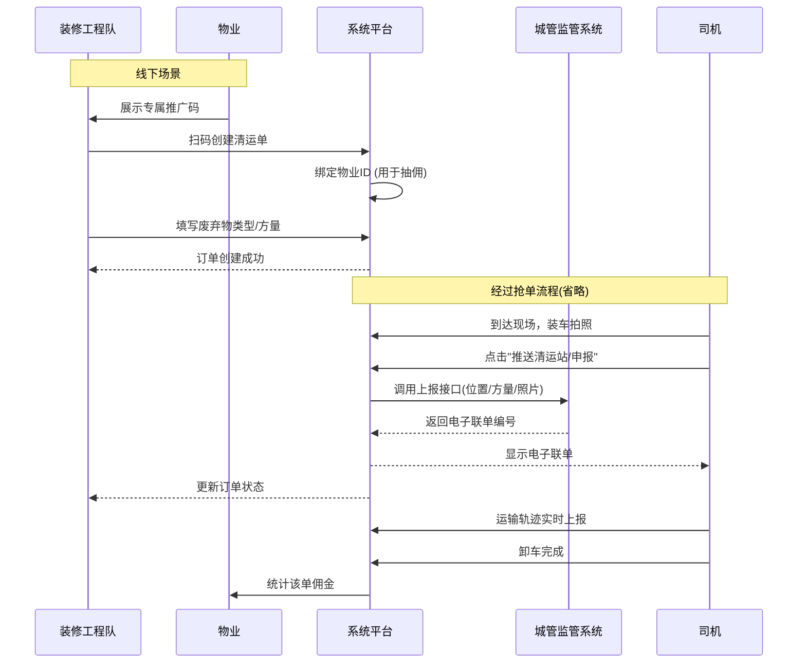
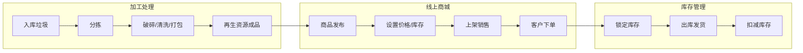
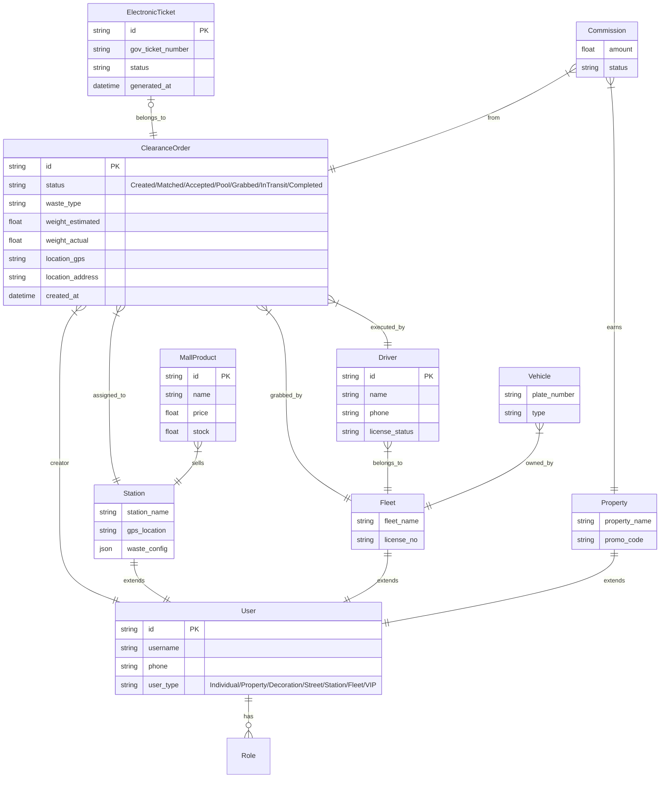
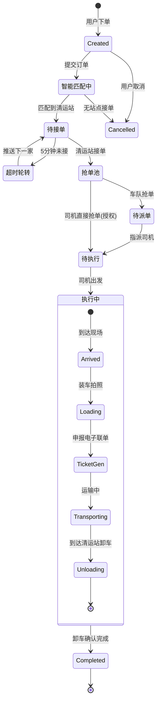

# 智慧垃圾清运系统 UML 图表

本文档包含基于《智慧垃圾清运系统需求规格说明书 v4.1》绘制的系统用例图和核心业务流程图。

## 1. 系统总体用例图 (Use Case Diagram)

该图展示了系统的七大核心角色及司机角色与系统功能的交互关系。

```mermaid
usecaseDiagram
    %% 角色定义
    actor "个体户" as Individual
    actor "物业" as Property
    actor "装修工程队" as Decoration
    actor "街道办" as Street
    actor "清运站" as Station
    actor "车队" as Fleet
    actor "VIP客户" as VIP
    actor "司机" as Driver

    package "智慧垃圾清运系统" {
        %% 个体户用例
        usecase "智能下单(GPS/AI识别)" as UC_Individual_Order
        usecase "扫码投递" as UC_Scan_Drop
        usecase "积分商城兑换" as UC_Points

        %% 物业用例
        usecase "多小区管理" as UC_Prop_Multi
        usecase "推广码分享与抽佣" as UC_Prop_Commission
        usecase "满溢报警监控" as UC_Prop_Monitor
        usecase "巡查上报" as UC_Prop_Report

        %% 装修队用例
        usecase "创建工程清运单" as UC_Deco_Order
        usecase "扫码绑定物业" as UC_Deco_Bind
        usecase "电子联单申报" as UC_Deco_Ticket

        %% 街道办用例
        usecase "数据驾驶舱(全域监管)" as UC_Street_Dashboard
        usecase "违规预警处理" as UC_Street_Alert
        usecase "创建街道清运单" as UC_Street_Order

        %% 清运站用例
        usecase "站点配置(规则/价格)" as UC_Station_Config
        usecase "智能接单/抢单池发布" as UC_Station_Order
        usecase "入库计量(地磅对接)" as UC_Station_Weigh
        usecase "再生资源商城管理" as UC_Station_Mall

        %% 车队用例
        usecase "运力管理(司机/车辆)" as UC_Fleet_Manage
        usecase "公海抢单/内部派单" as UC_Fleet_Order
        usecase "自主下单" as UC_Fleet_SelfOrder
        usecase "绩效与收入统计" as UC_Fleet_Stat

        %% VIP用例
        usecase "周期清运配置" as UC_VIP_Cycle
        usecase "月结对账" as UC_VIP_Bill
        usecase "ESG报表导出" as UC_VIP_Report

        %% 司机用例
        usecase "任务执行(装车/拍照/轨迹)" as UC_Driver_Task
        usecase "电子联单上报" as UC_Driver_Ticket
        usecase "多车往返作业" as UC_Driver_MultiTrip
    }

    %% 关系连接
    Individual --> UC_Individual_Order
    Individual --> UC_Scan_Drop
    Individual --> UC_Points

    Property --> UC_Prop_Multi
    Property --> UC_Prop_Commission
    Property --> UC_Prop_Monitor
    Property --> UC_Prop_Report

    Decoration --> UC_Deco_Order
    Decoration --> UC_Deco_Bind
    Decoration --> UC_Deco_Ticket
    UC_Deco_Bind ..> UC_Prop_Commission : 触发抽佣

    Street --> UC_Street_Dashboard
    Street --> UC_Street_Alert
    Street --> UC_Street_Order

    Station --> UC_Station_Config
    Station --> UC_Station_Order
    Station --> UC_Station_Weigh
    Station --> UC_Station_Mall

    Fleet --> UC_Fleet_Manage
    Fleet --> UC_Fleet_Order
    Fleet --> UC_Fleet_SelfOrder
    Fleet --> UC_Fleet_Stat

    VIP --> UC_VIP_Cycle
    VIP --> UC_VIP_Bill
    VIP --> UC_VIP_Report

    Driver --> UC_Driver_Task
    Driver --> UC_Driver_Ticket
    Driver --> UC_Driver_MultiTrip
    Fleet --> Driver : 管理/派单
```

## 2. 核心业务流程图

### 2.1 通用清运闭环流程 (泳道图)

展示从用户下单到最终结算的完整全链路流程。

```mermaid
flowchart TD
    subgraph User [下单端 (个体户/装修队/街道/VIP)]
        Start((开始)) --> CreateOrder[创建清运单]
        CreateOrder --> AI_GPS[GPS定位 & AI识别]
        AI_GPS --> SubmitOrder[提交订单]
    end

    subgraph System [平台/系统]
        SubmitOrder --> MatchStation{智能匹配清运站}
        MatchStation -->|匹配成功| PushStation[推送给最近清运站]
        PushStation --> Timer{5分钟未接?}
        Timer -->|是| PushNext[推送下一家]
        PushNext --> PushStation
        Timer -->|否| StationAccepted[清运站已接单]
        StationAccepted --> ReleasePool[发布至抢单池]
    end

    subgraph Station [清运站]
        PushStation --> AcceptOrder[接单]
        AcceptOrder --> StationAccepted
    end

    subgraph FleetDriver [车队/司机]
        ReleasePool --> FleetGrab[车队抢单]
        FleetGrab --> AssignDriver[指派司机]
        AssignDriver --> DriverExec[司机执行任务]
        DriverExec --> Arrive[到达产生点]
        Arrive --> LoadPhoto[装车拍照]
        LoadPhoto --> PushTicket[推送清运站/申报联单]
        PushTicket --> MultiCar{是否多车?}
        MultiCar -->|是| Transport[运输]
        Transport --> Unload[卸车拍照]
        Unload --> Return[返回产生点]
        Return --> LoadPhoto
        MultiCar -->|否| TransportFinal[运输至清运站]
    end

    subgraph StationWork [清运站作业]
        TransportFinal --> Inbound[进站识别]
        Inbound --> Weighing[地磅称重]
        Weighing --> UnloadFinal[卸车确认]
        UnloadFinal --> FinishOrder((订单完成))
    end

    DriverExec -.->|轨迹记录| System
```

### 2.2 装修垃圾专项流程 (时序图)

展示装修队扫码绑定物业及电子联单生成的详细交互。



### 2.3 再生资源商城流程

展示清运站处理垃圾后转化为商品销售的流程。



## 3. 补充设计图表

### 3.1 实体关系图 (ER Diagram)

展示系统核心实体及其关联关系。



### 3.2 订单状态机图 (State Diagram)

展示清运单从创建到完成的全生命周期状态流转。


